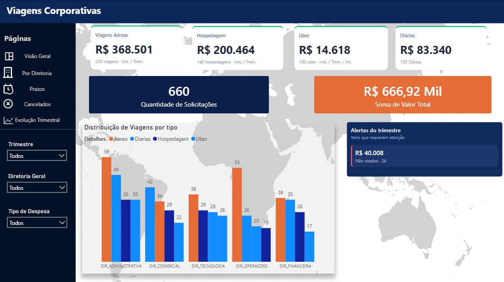
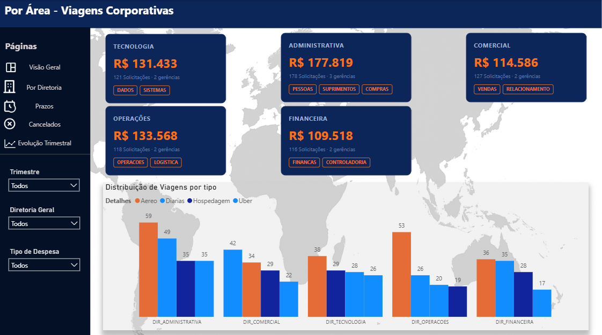
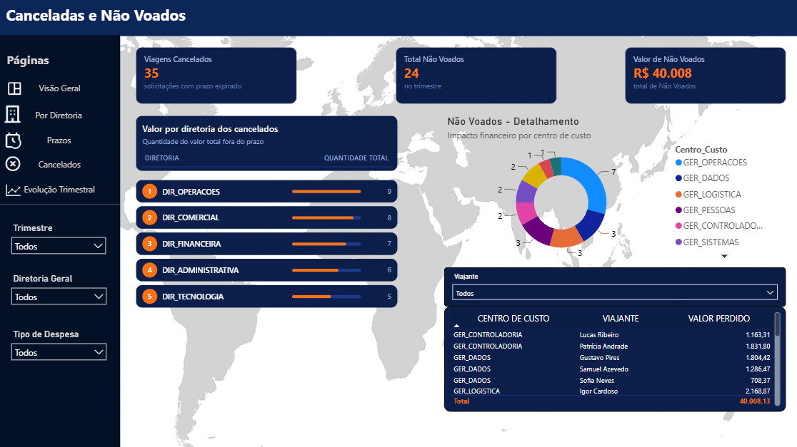
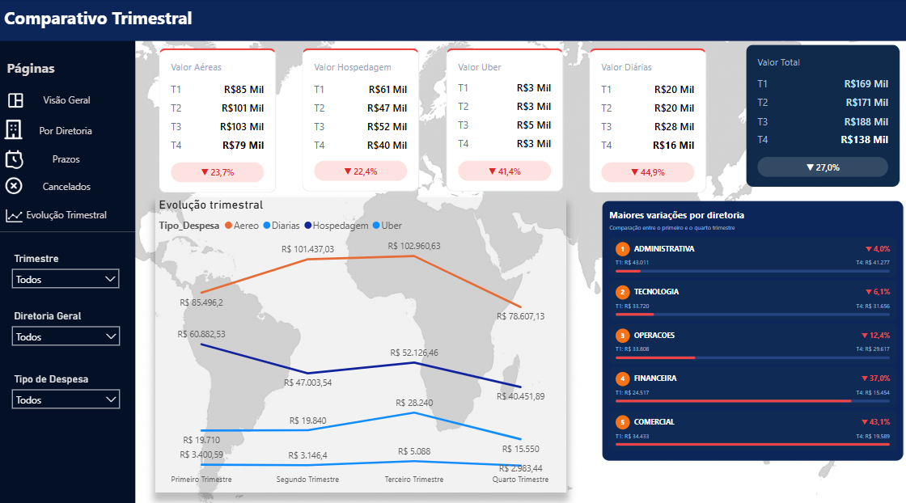
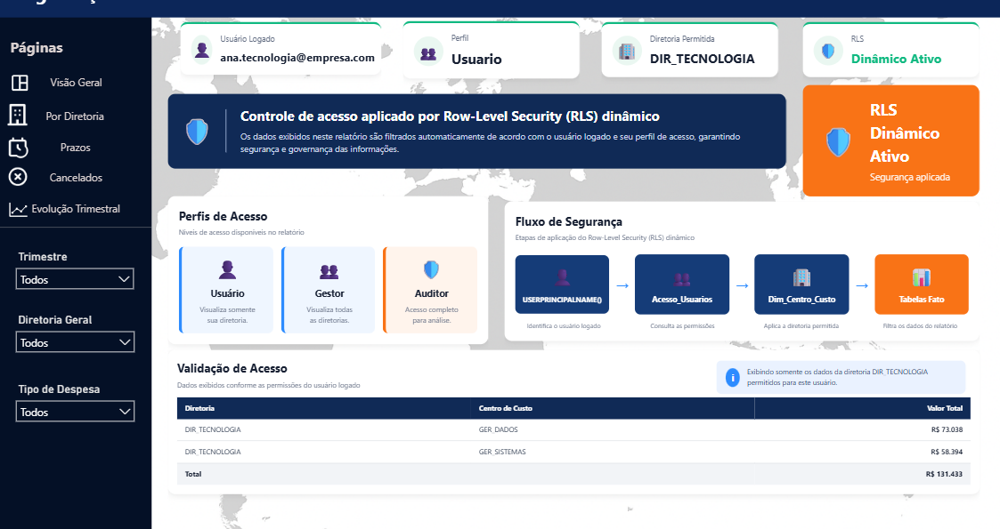

# Dashboard de Viagens Corporativas

Projeto de portfólio em **Business Intelligence**, desenvolvido com **Power BI, Power Query e DAX**, utilizando exclusivamente dados fictícios.

> Este projeto foi reestruturado para fins educacionais e de portfólio. Todos os dados, usuários, centros de custo, diretorias e demais informações presentes no repositório são fictícios.

---

## Sobre o projeto

O projeto simula um cenário corporativo no qual diferentes fontes relacionadas a viagens precisam ser consolidadas para apoiar a análise de:

- passagens aéreas;
- hospedagens;
- transporte urbano;
- diárias;
- prazos de solicitação;
- cancelamentos;
- passagens emitidas e não utilizadas;
- gastos por diretoria;
- gastos por centro de custo;
- evolução trimestral.

Além da construção dos dashboards, o projeto também contempla conceitos de:

- ETL;
- modelagem dimensional;
- DAX;
- contexto de filtro;
- análise temporal;
- segurança;
- Row-Level Security;
- governança de dados;
- navegação;
- visuais personalizados em HTML.

---

# Objetivo

Construir uma solução de Business Intelligence capaz de transformar diferentes fontes de dados de viagens corporativas em informações analíticas para apoio à tomada de decisão.

A solução permite responder perguntas como:

- Quanto foi gasto com viagens?
- Qual tipo de despesa representa maior valor?
- Quais diretorias concentram os maiores gastos?
- Como os gastos evoluíram ao longo dos trimestres?
- Quantas solicitações foram canceladas?
- Qual o impacto financeiro das passagens não utilizadas?
- Quais centros de custo apresentam maior volume?
- Os usuários estão realizando as solicitações dentro dos prazos?
- Como restringir a visualização dos dados conforme o perfil do usuário?

---

# Tecnologias utilizadas

- Power BI
- Power Query
- DAX
- Excel
- HTML/CSS em medidas DAX
- Git
- GitHub

---

# Arquitetura

O fluxo principal da solução é:

```text
Excel fictício
      ↓
Power Query
      ↓
Tratamento e padronização
      ↓
Queries Raw
      ↓
Base_Geral + tabelas operacionais
      ↓
Modelo dimensional
      ↓
Medidas DAX
      ↓
RLS Dinâmico
      ↓
Dashboard Power BI
```

A documentação detalhada da arquitetura está disponível em:

`docs/arquitetura.md`

---

# Fonte de dados

A principal fonte utilizada pelo projeto é:

```text
data/viagens_ficticias.xlsx
```

O arquivo contém dados fictícios relacionados a:

- passagens aéreas;
- hospedagens;
- transporte urbano;
- diárias;
- cancelamentos;
- passagens não utilizadas.

Todos os dados foram preparados exclusivamente para fins de estudo e demonstração.

---

# Power Query

Os dados passam por uma etapa de tratamento e padronização antes de serem carregados no modelo.

As principais queries são:

```text
Passagem_Raw
Uber_Raw
Hospedagem_Raw
Diarias_Raw
Cancelados_Raw
Nao_Voados_Raw
Base_Geral
```

Entre as principais transformações realizadas estão:

- definição de tipos de dados;
- tratamento de datas;
- padronização dos nomes das colunas;
- padronização de diretoria;
- padronização de centro de custo;
- padronização dos valores;
- criação do tipo de despesa;
- criação do trimestre;
- cálculo de prazo;
- classificação das solicitações;
- consolidação das fontes.

A documentação detalhada está disponível em:

`power-query/transformacoes.md`

---

# Base Geral

A `Base_Geral` é a principal tabela consolidada utilizada nas análises do dashboard.

Ela combina registros provenientes de:

```text
Passagem_Raw
Uber_Raw
Hospedagem_Raw
Diarias_Raw
```

A consolidação permite que diferentes tipos de despesas sejam analisados utilizando uma estrutura comum.

Entre os principais campos utilizados estão:

```text
Viajante
Data
Diretoria
Centro_Custo
Tipo_Despesa
Valor_Total
Trimestre
```

As tabelas `Cancelados_Raw` e `Nao_Voados_Raw` permanecem separadas por representarem eventos operacionais específicos.

---

# Modelo de dados

O modelo utiliza dimensões para centralizar os principais filtros analíticos.

## Dim_Trimestre

Responsável pela organização temporal do relatório.

Estrutura:

```text
Trimestre
Ordem
```

A coluna `Ordem` garante a sequência correta:

```text
T1 → T2 → T3 → T4
```

---

## Dim_Centro_Custo

Responsável pela estrutura organizacional.

Principais campos:

```text
Diretoria
Centro_Custo
```

A dimensão é utilizada tanto para os filtros das análises quanto para a propagação das regras de segurança.

---

## Relacionamentos

Estrutura simplificada:

```text
Dim_Trimestre
      │
      ├──→ Base_Geral
      ├──→ Diarias_Raw
      ├──→ Cancelados_Raw
      └──→ Nao_Voados_Raw
```

```text
Dim_Centro_Custo
      │
      ├──→ Base_Geral
      ├──→ Diarias_Raw
      ├──→ Cancelados_Raw
      └──→ Nao_Voados_Raw
```

Os relacionamentos utilizam a lógica:

```text
Dimensão 1 → * Tabela Fato
```

---

# DAX

As medidas DAX foram organizadas em diferentes grupos.

## Indicadores gerais

- Soma Valor Total
- Quantidade Total

## Tipos de despesa

- Valor Aéreo
- Quantidade Aéreo
- Valor Hospedagem
- Quantidade Hospedagem
- Valor Uber
- Quantidade Uber
- Valor Total Diárias
- Quantidade Diárias

## Indicadores operacionais

- Quantidade Cancelados
- Valor Cancelado
- Quantidade Não Voados
- Valor Não Voado

## Análise temporal

- Valor Total T1
- Valor Total T2
- Valor Total T3
- Valor Total T4
- Variação T1 x T4
- Ranking de Variação

## Segurança

- Usuário Logado
- Perfil Usuário
- Diretoria Permitida
- Status RLS
- Quantidade de Diretorias Visíveis
- Quantidade de Centros Visíveis
- Descrição de Acesso

A documentação das principais medidas está disponível em:

`dax/medidas.md`

---

# Row-Level Security

O projeto implementa **Row-Level Security (RLS) dinâmico**.

A identificação do usuário é realizada por meio de:

```DAX
USERPRINCIPALNAME()
```

O fluxo de segurança utilizado é:

```text
USERPRINCIPALNAME()
        ↓
Acesso_Usuarios
        ↓
Perfil + Diretoria
        ↓
Dim_Centro_Custo
        ↓
Tabelas Fato
```

---

## Tabela de acesso

A tabela fictícia:

```text
Acesso_Usuarios
```

possui os seguintes campos:

```text
Email
Diretoria
Perfil
```

Os perfis simulados são:

### Usuário

Visualiza somente os dados relacionados à diretoria permitida.

### Gestor

Possui acesso às diretorias definidas pela regra de acesso total.

### Auditor

Possui acesso completo para fins de análise e validação.

---

## Segurança x Navegação

A navegação do relatório não é utilizada como mecanismo de segurança.

```text
Navegação = experiência do usuário
RLS = segurança dos dados
```

Mesmo que determinada página possa ser acessada, o RLS continua controlando quais linhas o usuário pode visualizar.

---

# Páginas do Dashboard

## 1. Visão Geral

Apresenta os principais indicadores executivos do relatório.

Entre eles:

- gastos com passagens aéreas;
- hospedagem;
- Uber;
- diárias;
- valor total;
- quantidade total;
- distribuição por diretoria;
- alertas operacionais.

---

## 2. Por Diretoria

Permite comparar os resultados entre as diretorias fictícias utilizadas no projeto:

```text
DIR_TECNOLOGIA
DIR_ADMINISTRATIVA
DIR_COMERCIAL
DIR_OPERACOES
DIR_FINANCEIRA
```

---

## 3. Detalhes por Diretoria

Foram desenvolvidas páginas específicas para detalhar os resultados de cada diretoria.

Os indicadores respondem ao contexto da área selecionada.

---

## 4. Prazos

Página dedicada à análise da antecedência das solicitações.

Permite identificar:

- volume por classificação;
- solicitações fora do prazo;
- distribuição por área;
- comportamento das solicitações.

---

## 5. Cancelados e Não Voados

Página dedicada a eventos operacionais.

Permite analisar:

- quantidade de cancelamentos;
- valor cancelado;
- quantidade de passagens não utilizadas;
- valor não utilizado;
- diretorias;
- centros de custo;
- viajantes.

---

## 6. Evolução Trimestral

Permite comparar o comportamento dos gastos entre:

```text
T1
T2
T3
T4
```

A página inclui:

- indicadores por tipo de despesa;
- gráfico de evolução trimestral;
- comparação entre períodos;
- variação T1 x T4;
- ranking de variação por diretoria.

---

## 7. Segurança / RLS

Página técnica utilizada para demonstrar o funcionamento da política de segurança.

Apresenta:

- usuário autenticado;
- perfil;
- diretoria permitida;
- status do RLS;
- perfis disponíveis;
- fluxo da regra de segurança;
- dados visíveis após a aplicação do RLS.

Essa página fica fora da navegação analítica principal e pode ser acessada por meio de um botão específico.

---

# Visuais personalizados

Alguns componentes foram desenvolvidos utilizando medidas DAX que retornam HTML.

Entre eles:

- cards personalizados;
- rankings;
- indicadores de segurança;
- fluxo do RLS;
- tabela de validação;
- elementos de navegação e apresentação.

Esses componentes complementam os visuais nativos do Power BI.

---

# Dashboard

## Visão Geral



---

## Análise por Diretoria



---

## Cancelados e Não Voados



---

## Evolução Trimestral



---

## Segurança e RLS



---

# Estrutura do repositório

```text
powerbi-viagens-corporativas/
│
├── data/
│   └── viagens_ficticias.xlsx
│
├── powerbi/
│   └── dashboard_viagens.pbix
│
├── dax/
│   └── medidas.md
│
├── power-query/
│   └── transformacoes.md
│
├── docs/
│   ├── arquitetura.md
│   └── seguranca-e-governanca.md
│
├── images/
│   ├── visao-geral.png
│   ├── por-diretoria.png
│   ├── cancelados-nao-voados.png
│   ├── evolucao-trimestral.png
│   └── seguranca-rls.png
│
└── README.md
```

---

# Privacidade e segurança

Todos os dados presentes neste projeto são fictícios.

O repositório público não deve conter:

- informações pessoais reais;
- nomes de colaboradores reais;
- informações corporativas reais;
- URLs internas;
- credenciais;
- tokens;
- identificadores internos;
- arquivos privados;
- conexões com ambientes corporativos.

O arquivo publicado foi preparado para utilizar exclusivamente a base fictícia presente no projeto.

---

# Principais aprendizados

Durante o desenvolvimento do projeto foram aplicados conceitos de:

- ETL com Power Query;
- consolidação de múltiplas fontes;
- tratamento e padronização de dados;
- modelagem dimensional;
- relacionamentos entre dimensões e fatos;
- DAX;
- contexto de filtro;
- análise temporal;
- indicadores operacionais;
- design de dashboards;
- navegação no Power BI;
- visuais HTML;
- Row-Level Security;
- segurança;
- governança;
- documentação técnica;
- versionamento com Git e GitHub.

---

# Possíveis evoluções

Embora o escopo principal esteja concluído, algumas evoluções futuras podem incluir:

- publicação no Power BI Service;
- atualização automatizada dos dados;
- integração com novas fontes;
- dimensão calendário completa;
- novos indicadores de eficiência;
- análise de orçamento x realizado;
- acompanhamento de economia por negociação;
- expansão das regras de acesso.

---

# Status

**Dashboard desenvolvido e funcional.**

O projeto encontra-se em fase de revisão final para publicação no portfólio.

---

## Documentação complementar

- [Arquitetura do projeto](docs/arquitetura.md)
- [Transformações no Power Query](power-query/transformacoes.md)
- [Medidas DAX](dax/medidas.md)
- [Segurança e Governança](docs/seguranca-e-governanca.md)